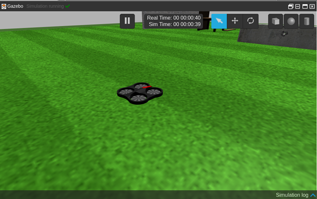

# Тестирование того, что вы установили

Во-первых, нужно протестировать, что вы получили. Для этого выполните следующие действия: Запустите моделирование дрона Parrot . На RDS вы можете найти его как Parrot AR.Drone в меню Simulations . После запуска вы увидите окно, подобное этому.



Давайте запустим наш пакет, чтобы он начал обучение дрона Parrot. Для этого введите следующее в предыдущем окне:

```text
> roslaunch drone_training main.launch
```

Вы должны увидеть, как дрон начинает двигаться, делая некоторые странные вещи. Это действительно выглядит так, как будто дрон пьян! Это вполне логично.


То, что происходит, - это то, что робот учится. Он исследует свое пространство действий и практикует то, что он будет чувствовать, основываясь на действиях, которые он совершает. Именно так работает проблема обучения с подкреплением. В основном, робот выполняет классическую RL петлю:


Агент\(Agent\) \(дрон+ алгоритм обучения\), решает предпринять действие\(action\) из доступных действий \(например, двигаться вперед\) и выполняет его в окружающей среде\(environment\) \(дрон движется вперед\). Результат этого действия, делает агента ближе или нет к своей цели \(чтобы долететь до заданного места\). Если робот находится ближе, он получает хорошее вознаграждение\(reward\). Если он находится дальше, то получает плохую награду. В любом случае, агент воспринимает текущее состояние\(state\) себя и окружающей среды \(где он находится в настоящее время\), а затем запоминает вознаграждение, предыдущее состояние, новое состояние и действие, предпринятое к алгоритму обучения \(чтобы узнать результаты, основанные на его действиях\). Затем процесс повторяется еще раз для того количества шагов, которое роботу разрешено производить. Когда количество шагов будет выполнено, будет получена окончательная награда и робот снова стартует с начальной позиции, теперь уже с улучшенным алгоритмом. Весь процесс повторяется снова и снова для заданного количества эпизодов \(обычно высокого\).

Теперь давайте посмотрим, как все это работает вместе в коде. Давайте посмотрим его структуру:

